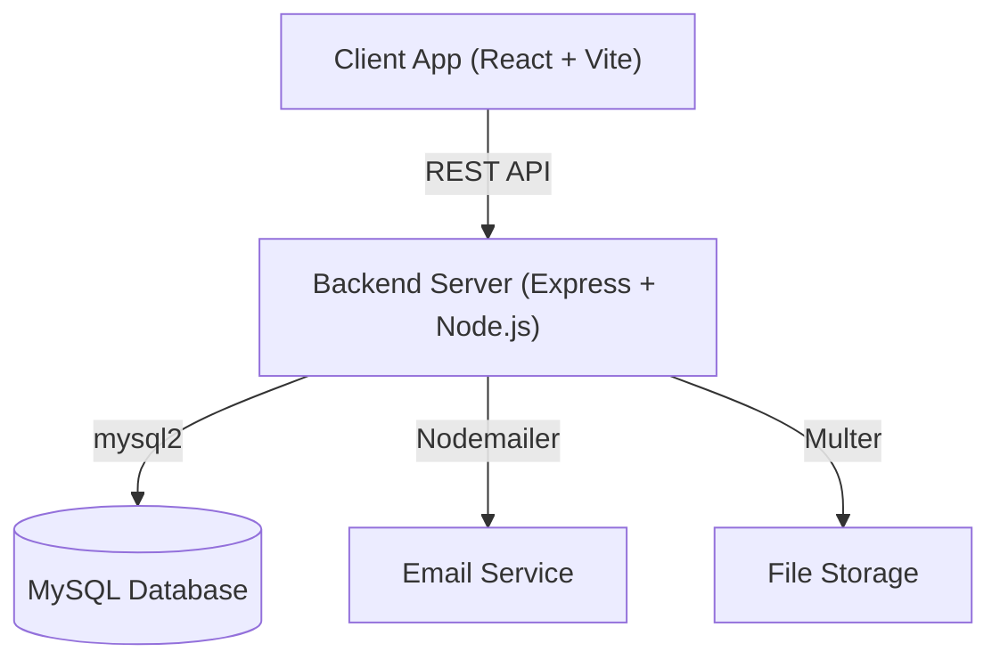

# 🛡️ Hostel Haven - Tech Stack Overview

This document outlines the comprehensive technology stack used in the Hostel Haven project. It is structured to be easily adapted into presentation slides or an architectural review document.

## 🌟 Architecture at a Glance

## 💻 Frontend (Client-Side)

The frontend is built with performance, type-safety, and a premium user experience in mind.

| Technology | Purpose | Key Benefits |
| :--- | :--- | :--- |
| **React 18** | Core UI Library | Component-based architecture, hooks, and concurrent rendering. |
| **TypeScript** | Language | Static typing, enhanced developer experience, and fewer runtime errors. |
| **Vite** | Build Tool | Lightning-fast HMR (Hot Module Replacement) and optimized production builds. |
| **Tailwind CSS** | Styling | Utility-first CSS framework for rapid and responsive UI development. |
| **Shadcn UI & Radix UI** | UI Components | Accessible, highly customizable, and premium-looking interface elements. |
| **React Router v6** | Navigation | Client-side routing, nested routes, and role-based route protection. |
| **TanStack Query v5** | Server State | Efficient data fetching, caching, synchronization, and state management. |
| **React Hook Form & Zod** | Form Handling | Performant form management with strict schema-based validation. |

### 🎨 Frontend Ecosystem Highlights
- **Data Visualization**: `Recharts` for rendering beautiful, interactive charts and analytics on dashboards.
- **Iconography & Feedback**: `Lucide React` for clean icons and `Sonner` for elegant toast notifications.
- **QR Code Integration**: `html5-qrcode` & `qrcode.react` for scanning and generating QR codes (e.g., for attendance or quick access).
- **Theming & PWA**: `Next Themes` for seamless dark/light mode switching, and `vite-plugin-pwa` for offline capabilities and installability.

---

## ⚙️ Backend (Server-Side)

The backend acts as a robust, secure RESTful API layer designed for efficiency and scalability.

| Technology | Purpose | Key Benefits |
| :--- | :--- | :--- |
| **Node.js** | Runtime Environment | Asynchronous, event-driven JavaScript runtime ideal for I/O heavy apps. |
| **Express.js** | Web Framework | Minimalist web framework for building structured RESTful API endpoints. |
| **MySQL2** | Database & Driver | High-performance relational database management with a fast driver. |
| **JWT (JSON Web Tokens)**| Authentication | Stateless and secure user authentication across distributed systems. |
| **Bcrypt.js** | Security | Industry-standard secure password hashing algorithm. |
| **Multer** | File Handling | Middleware for efficiently processing `multipart/form-data` and file uploads. |
| **Nodemailer** | Communication | Robust module for sending automated transactional emails. |

### 🛡️ Backend Security & Utilities
- **Rate Limiting**: `express-rate-limit` protects against DDoS and brute-force attacks.
- **CORS**: Securely manages Cross-Origin Resource Sharing between the Vite frontend and Express backend.
- **Environment Management**: `dotenv` ensures sensitive credentials remain secure and environment-specific.

---

## 🚀 Presentation Talking Points (Key Features)
When presenting this stack, highlight how these technologies work together to deliver the core features:

1. **Role-Based Access Control (RBAC):** Emphasize how **React Router** (Frontend) pairs with **JWT** and custom Express middleware (Backend) to securely isolate Student, Parent, Warden, and Admin views.
2. **Real-Time Responsiveness:** Mention how **TanStack Query** drastically reduces load times and keeps the UI synced with the **MySQL** database.
3. **Premium Aesthetics:** Highlight **Tailwind CSS** combined with **Shadcn UI** to explain how the application achieves a modern, "glassmorphism" or high-end feel without sacrificing accessibility.
4. **Automated Workflows:** Describe the Leave Management feature, powered by **Express** controllers and **Nodemailer** to keep all parties informed instantly.
